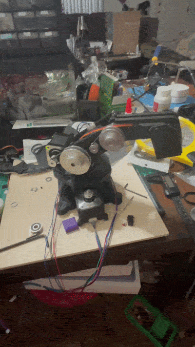
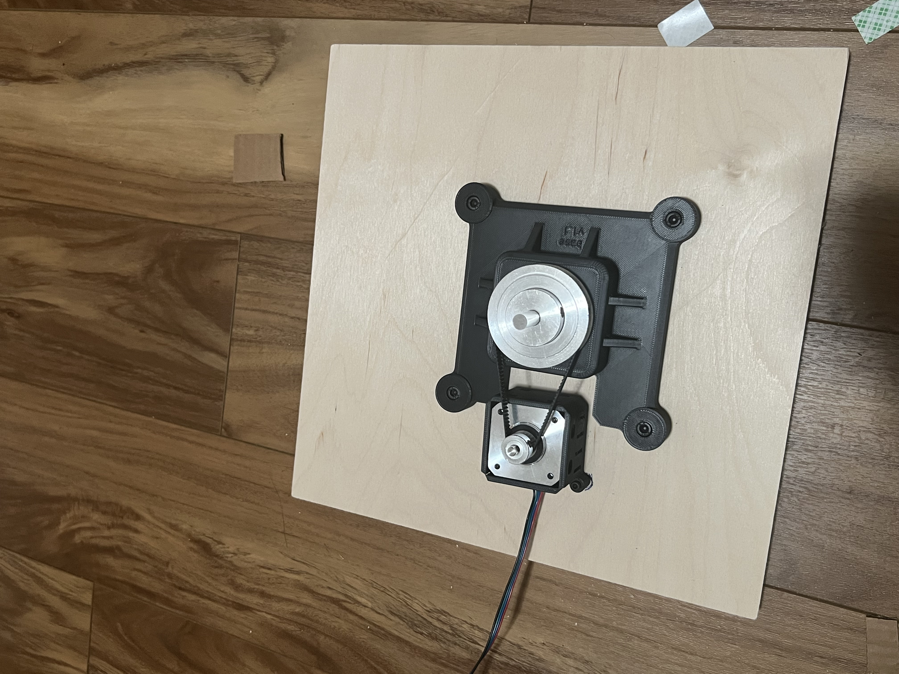
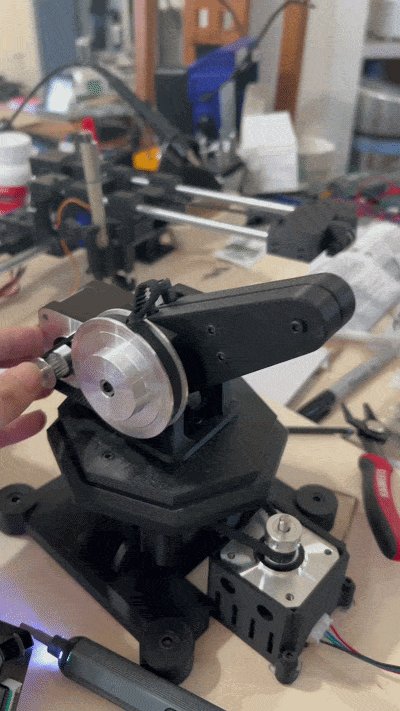
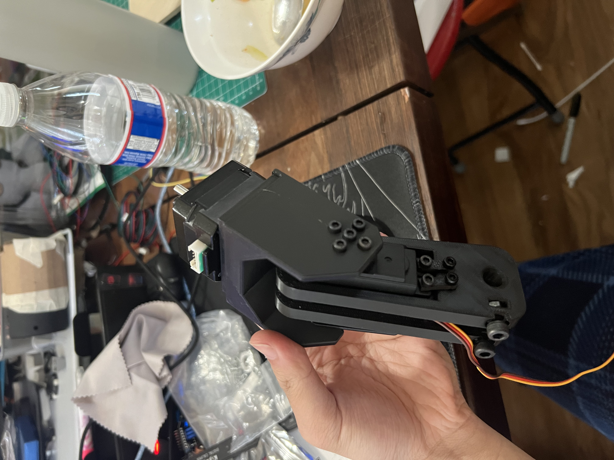
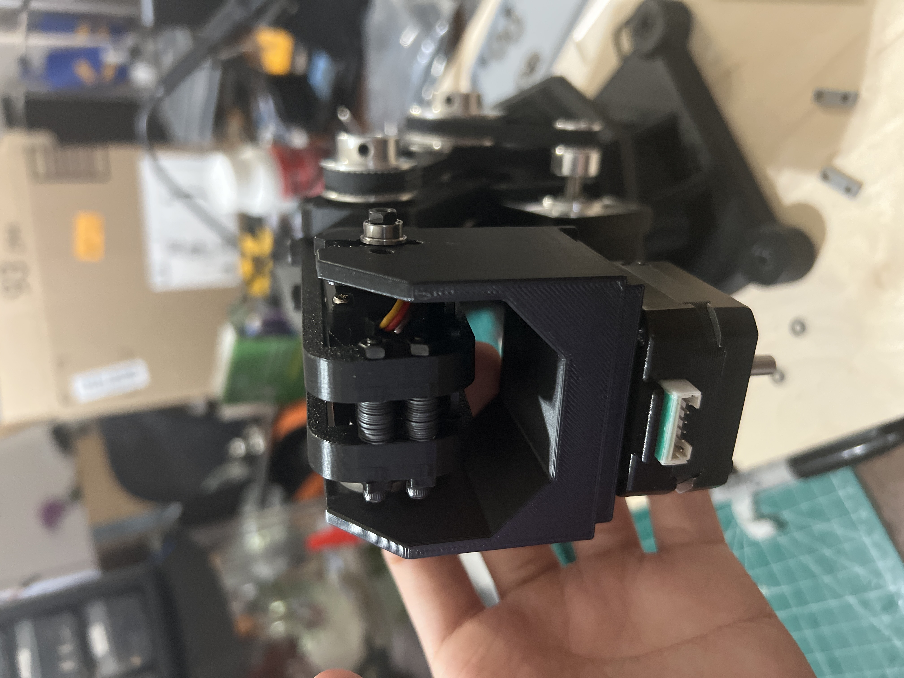

# Robotic-Arm-Prototype

## Brief Overview
Custom robotic arm prototype integrating CAD, 3D-printed components, servo motors, and Arduino control.

## WORK IN PROGRESS

## Project Goals
- Use stepper motors, belts, and pulleys to rotate joints under moderate load
- Design at least a 4 Degree of Freedom robotic arm prototype
- Be able to manually control the robotic arm and then move it with commands using inverse kinematics
- Build on CAD and learn how to design a robotic Gripper

## Mechanical Components
- 608 Ball Bearings
- 100x8 mm and 60x8mm steel rods
- idler pulley
- 20t, 60t, 80t pulley
- 6mm birchwood base
- M3 and M5 screws, nuts, and locknuts
- Closed-loop GT2 timing belts
- screw clamp housing piece

## Custom-designed mechanical components
- base1 (First base that is screw mounted on the birchwood)
- base2 (second base that is installed to the rotating base pulley)
- baes2 lid
- shoulder base (Supports the shoulder joint)
- Shoulder Arms
- Forearms
- Wrist
- Gripper (WIP)

## Electronics
- Arduino UNO R3
- NEMA 17 Stepper motors
- CNC shield
- MG90 metalgear servo
- limit switches
- MG996R servo
- Buck Converter

## Software
- Arduino IDE
- Autodesk Fusion

## How does it work?
Stepper motors are energized and drives a pulley using a pulley reduction to rotate the joint and lift the arm.
Version one will simply be manual control using potentiometers and buttons for each degree of freedom.
Version two will implement movement using commands via inverse kinematics
 

## Timeline/Milestones
1. Designed, fabricated, and installed the base and nema housing

   

2. Shoulder Joint
   > - Two arms for the shoulder so I'm able to install a NEMA stepper in between for the next joint and act as a base for the next joint
   > - Clamped the arms onto a horizontally installed steel rod. Pulley is also clamped onto the rod and actually is the driving mechanism that is linked via a belt to the stepper.
   > - 608 rotating bearings are installed for smooth shaft rotation
   > - Stepper rotates, pulley rotates, shaft rotates, arm rotates.
   
   

4. Shoulder optimization and elbow joint

 > - Used a slightly longer steel rod so the shoulder base was wider
 >  - Elbow joint uses the same mechanism.

5. Wrist joint

  > - Wrist joint uses a servo mounted structure
  > - Used a metal servo mounting bracket to install the servo and install it between the arms.
  > - MG996R Servo is used for torque to utilize direct drive
  > - Mounted screw holes are added for the prospective gripper

   

   
  
